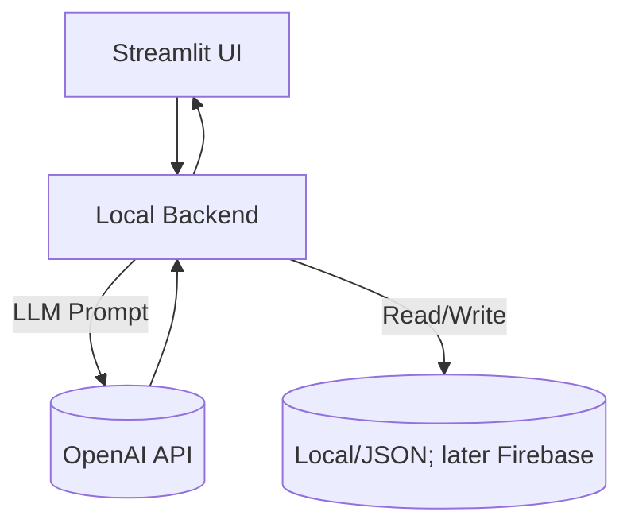
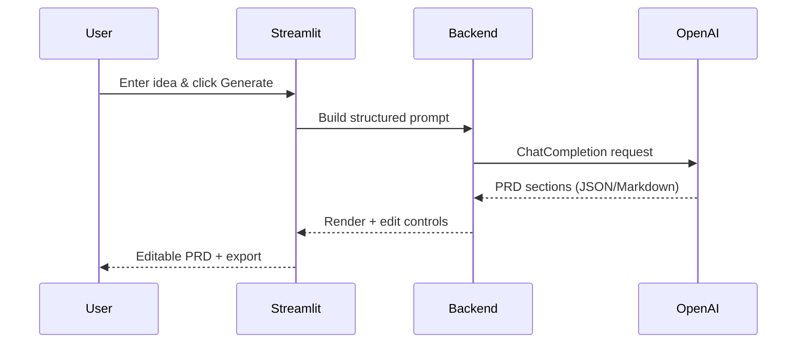

# System Architecture

```mermaid
flowchart TD
  UI[Streamlit UI] --> API[Local Backend]
  API -->|LLM Prompt| OpenAI[(OpenAI API)]
  API -->|Read/Write| Storage[(Local/JSON; later Firebase)]
  OpenAI --> API --> UI
```

## Sequence (Generate PRD)

```mermaid
sequenceDiagram
  participant U as User
  participant S as Streamlit
  participant B as Backend
  participant O as OpenAI
  U->>S: Enter idea & click Generate
  S->>B: Build structured prompt
  B->>O: ChatCompletion request
  O-->>B: PRD sections (JSON/Markdown)
  B-->>S: Render + edit controls
  S-->>U: Editable PRD + export
```
